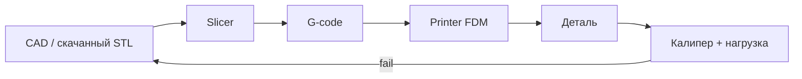
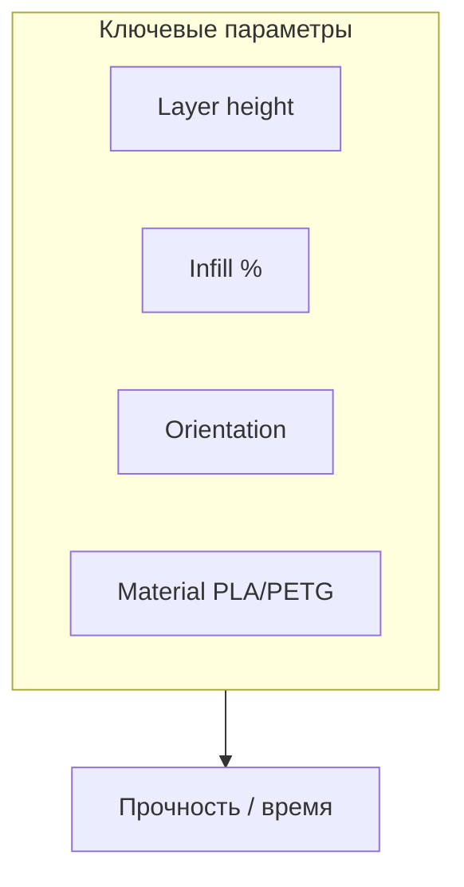

# ENGINEERING ROADMAP
## Том 5 · Лаборатория №3 — 3D-печать

> **🟣 Архитектор технологий** · Миссия дня

---

## 📡 История

Дрон (Лаб. №2) **ломает** пластиковые клипсы. Робот из Тома 4 **не** влезает в **стандартный** кронштейн. Ждать **доставку** — не стиль инженера: **3D-печать** превращает **файл на диске** в **атомы на столе**. Это **мост** между **CAD** (следующая лаба) и **реальной** механикой. Сегодня — **FDM** с нуля: слайсер, слои, материалы, **безопасность** и **первая** осмысленная деталь для твоего стека.

---

## 🚀 Миссия

**Напечатать** инженерную деталь (кронштейн / короб / клипса) с **документированными** настройками и **оценкой** прочности для задачи.

---

## 🎯 Цель

- **понять** цепочку **STL/OBJ → slicer → G-code → принтер**;
- **настроить** профиль **PLA/PETG** под **свой** или **школьный** принтер;
- **сделать** деталь **≥ 2 ч** печати **или** мини-проект **≤ 45 min** на готовом G-code.

**Результат:** файл `~/Moja_Laboratoria/T5/print/job_profile.md`, **напечатанная** деталь (фото), **калибровочный** куб или башня **или** доказательство успешной печати.

---

## ⏱ Время

3–5 часов (печать **может** идти **ночью** — **3–4 дня** по 30–60 мин активной работы).

---

## 🧰 Что понадобится

- [ ] FDM-принтер (Ender / Prusa / Bambu / школьная лаборатория) **или** доступ к **FabLab**
- [ ] Филамент **PLA** (проще) или **PETG** (прочнее)
- [ ] SD / USB / OctoPrint (если есть Том 3 — **опционально**)
- [ ] Слайсер: **PrusaSlicer / Cura / OrcaSlicer**
- [ ] Калипер или линейка
- [ ] dnevnik.txt

---

## 🤔 Как ты думаешь?

**Не читай ответ сразу.**

1. Почему **0.2 mm** слой **быстрее**, но **грубее**, чем **0.12 mm**?
2. Деталь **«на глаз крепкая»** — достаточно ли для **крепления LiPo** на дроне?
3. Можно ли **напечатать** **оружие** или **ключ** от чужой двери — и **где** этика?

*(Запиши в dnevnik.)*

**Настоящее объяснение:** FDM = **экструзия** расплавленной нити **слоями**. Прочность **анизотропна** (вдоль слоёв **слабее**). Инженер **выбирает** материал, **заполнение**, **ориентацию** на столе. 3D-печать **не** «серый рынок магии» — **закон и этика**: не воспроизводи **запрещённые** предметы; **ответственность** на **дизайнере**.

---

## 💡 Аналогия

**3D-печать** = **штабель блинов** из теста: каждый слой — **круг**, снизу **поддержки** (supports), если **нависание**. Слайсер — **повар**, который **режет** модель на **рецепт** (G-code).

| В жизни | 3D-печать |
|---------|-----------|
| Рецепт | **G-code** |
| Толщина ломтя | **Layer height** |
| Начинка | **Infill %** |
| Форма для выпечки | **Build plate** |
| Этика | **Не печатай** то, что **вредит** |

### 😲 ВАУ!

На **МКС** печатали **запчасти** и **инструменты** — когда **ракета** уже **в orbit**. Твой принтер — **мини-логистический** центр **на столе**.

### 😄 Момент улыбки

«100% infill» — способ **превратить** деталь в **кирпич** и **принтер** в **сушилку** для филамента. **Инженер** считает **заполнение**.

---

## 📷 Иллюстрация

📷 **[Для художника]** `ILL-T5-L3-01` · Принтер **Ender-стиля** печатает **оранжевый** кронштейн; **слои** видны **наслоением** (cutaway); монитор — **PrusaSlicer** с **supports**; рядом — **калипер**; badge 🟣. Подпись: *«Файл → слой → деталь»*.

```
  [STL] → Slicer → [G-code] → Hotend → Layer n → Part
```

---

## 📊 Mermaid





---

## 🔬 Эксперимент

**Правило:** минимум **№1, №2, №3, №5**. Без принтера — **FabLab** + документация **с фото**; калибровка на **чужом** принтере **засчитывается**.

---

### Эксперимент 1 — «Профиль принтера»

**⏱** 25 мин

```bash
mkdir -p ~/Moja_Laboratoria/T5/print
nano ~/Moja_Laboratoria/T5/print/job_profile.md
```

Заполни:

| Поле | Твоё значение |
|------|---------------|
| Модель принтера | |
| Сопло | 0.4 mm |
| Материал | PLA / PETG |
| Temp сопло / стол | |
| Layer height | |
| Infill | |
| Adhesion | brim / skirt |

**✅ Проверь себя:** **все** поля **не пустые**.

---

### Эксперимент 2 — «Калибровочный куб 20 mm»

**⏱** 40 min печати + 10 min замер

Скачай **20 mm calibration cube** (Thingiverse / Printables) или создай в CAD позже.

После печати **калипером**:

```
X = ___ mm   Y = ___ mm   Z = ___ mm
Ошибка % = (измерение - 20) / 20 * 100
```

| Ось | Если > +0.2 mm | Если < -0.2 mm |
|-----|----------------|----------------|
| XY | Уменьши **flow** / scale | Увеличь flow |
| Z | Проверь **steps/mm** Z | — |

**✅ Проверь себя:** **3** измерения **в dnevnik**; куб **не** «расклеился» от стола.

---

### Эксперимент 3 — «Первый инженерный print»

**⏱** 60–180 min

Выбери **одно**:

- **Короб** для Raspberry Pi (вентиляция!)
- **Клипса** для кабеля на роботе
- **Кронштейн** камеры (не для **LiPo** без расчёта)

Слайсер: **orient** так, чтобы **нагрузка** шла **не** по слоям.

**✅ Проверь себя:** деталь **служит** заявленной цели **≥ 1 день** теста.

---

### Эксперимент 4 — «Башня температур / retractions»

**⏱** 45 min *(рекомендуется)*

Напечатай **temp tower** или **retraction test** — зафиксируй **лучший** диапазон для филамента.

**✅ Проверь себя:** в job_profile **обновлены** temp/retraction.

---

### Эксперимент 5 — «Этика и безопасность 3D»

**⏱** 15 min

В job_profile раздел **Ethics**:

1. **Не** печатать **оружие**, **ключи** чужих замков, **обход** DRM.
2. **Ventilation** — не дышать **ABS** без вытяжки.
3. **Fire** — **не** оставлять **без** термозащиты / камеры (если есть).
4. **Открытые** модели — **указать** лицензию (CC).

**✅ Проверь себя:** **4** пункта **своими словами**.

---

### Эксперимент 6 — «OctoPrint / удалённый мониторинг»

**⏱** 30 min *(если Том 3 + Pi)*

Поднять **OctoPrint** в Docker на Pi — **смотреть** прогресс **без** сидения у принтера.

**Этика:** камера в комнате — **не** транслировать **публично**.

**✅ Проверь себя:** скрин **прогресса** или схема **Pi → принтер USB**.

---

## ⚠ Типичные ошибки

| Ошибка | Как исправить |
|--------|---------------|
| Первый слой **слишком высоко** | Live Z / **bed leveling** |
| **Warping** PLA | Brim, **чистый** стол, **закрыть** draught |
| Infill **100%** «для прочности» | **40–60%** gyroid часто **достаточно** |
| Нагрузка **поперёк** слоёв | **Повернуть** модель |
| Печать **ABS** в спальне | **PLA/PETG** или **вытяжка** |
| Скачать **STL** без **лицензии** | Читай **Terms** |

---

## 🧪 Проверь себя

- [ ] job_profile.md **заполнен**
- [ ] Калибровочный куб **измерен**
- [ ] Инженерная деталь **напечатана** и **используется**
- [ ] Этика **4 пункта**
- [ ] Понимаешь **STL → G-code**
- [ ] Знаешь, **когда** печать **не** заменяет **металл**

---

## 📝 Запись в инженерный дневник

```
=== LAB №3 (TOM 5) ===
Data: ___
Printer / filament:
Kalibracja X/Y/Z: ___ / ___ / ___
Co drukowałem:
Infill / layer:
Ethics (1 zdanie):
Następny krok:
```

---

## 🏆 Что теперь умеешь

- [ ] **Настроить** slicer под **материал**
- [ ] **Измерить** точность **кубом**
- [ ] **Ориентировать** деталь под **нагрузку**
- [ ] **Документировать** профиль печати
- [ ] **Оценить** этические **границы** 3D

---

## ➡ Что дальше

**Следующий файл:** `04_LAB_CAD.md` — **Лаборатория №4:** **свой** STL, не только скачанный.

**Перед переходом:**

- [ ] Куб + инженерная деталь — **обязательно**
- [ ] job_profile — **обязательно**
- [ ] LAB №3 — **обязательно**

### 🔮 Вопрос без ответа

Скачанный STL **не** подходит по **отверстию** под **M3**. Как **изменить** модель **до** печати — **без** «магии» меша?

**Ответ — в Лаборатории №4.**

---

*Пока печатается слой 847 — открой слайсер и **посмотри**, как **G-code** рисует **перimeters**.*
