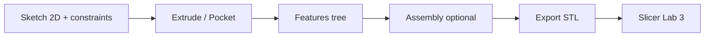
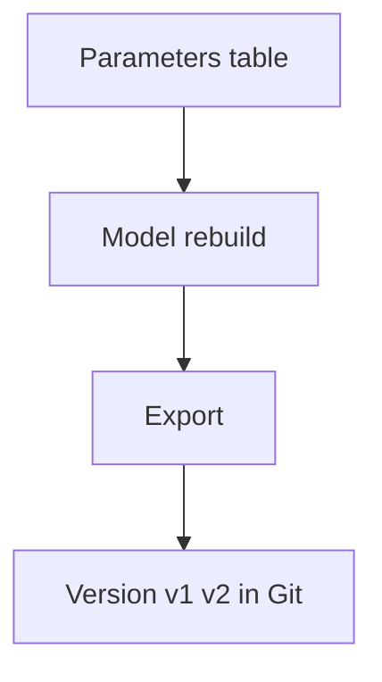

# ENGINEERING ROADMAP
## Том 5 · Лаборатория №4 — CAD

> **🟣 Архитектор технологий** · Миссия дня

---

## 📡 История

3D-печать (Лаб. №3) **ждёт** файл. Скачать **чужой** STL — быстро, но **отверстие** не **M3**, **кронштейн** не **Pi**, **дрон** не **твой**. **CAD** — язык, на котором инженер **говорит** с **принтером** и **ЧПУ**: **размеры**, **допуски**, **сборка**. Сегодня — **parametric** мышление: **изменил число** → **перестроилась** вся модель. Связь с **Git** из Тома 3: `.FCStd` / `.step` тоже **версионируй**.

---

## 🚀 Миссия

**Смоделировать** parametric деталь под **свой** проект, экспортировать **STL** и **напечатать** **или** передать в slicer.

---

## 🎯 Цель

- **освоить** sketch → extrude → **constraints**;
- **сделать** деталь с **≥ 3** размерами-параметрами;
- **экспортировать** STL и **проверить** в слайсере **без** ошибок mesh.

**Результат:** `~/Moja_Laboratoria/T5/cad/bracket_v1.FCStd` (или `.scad`), `bracket_v1.stl`, скрин **сборки** + запись в dnevnik.

---

## ⏱ Время

3–4 часа (можно **4 дня** по 45 min).

---

## 🧰 Что понадобится

- [ ] CAD: **FreeCAD** (рекомендуется) **или** **OpenSCAD** **или** Fusion 360 (personal)
- [ ] Завершённая Лаб. №3 (slicer, принтер или FabLab)
- [ ] Штангенциркуль / калипер
- [ ] dnevnik.txt

---

## 🤔 Как ты думаешь?

**Не читай ответ сразу.**

1. Зачем **parametric** модель, если **одна** деталь «и так сойдёт»?
2. Почему **0.1 mm** зазор для **M3** иногда **мало** на **FDM**?
3. Можно ли **продать** модель, **скопированную** с Thingiverse **без** лицензии?

*(Запиши в dnevnik.)*

**Настоящее объяснение:** CAD хранит **историю построения** — **ширина** = 40 mm → все **отверстия** и **фillets** **пересчитываются**. FDM **±0.2 mm** — **компенсируй** в модели (**offset**). **IP и этика:** CC лицензии **обязательны**; **плагиат** CAD — как **копипаст** кода без **license**.

---

## 💡 Аналогия

**Parametric CAD** = **рецепт с переменными**: `mąka = X` → **все** блюда **масштабируются**. **STL** = **замороженный** пирог — **исправить** сложно.

| В жизни | CAD |
|---------|-----|
| Чертёж на бумаге | **Sketch** |
| Вырезать форму | **Extrude / Cut** |
| «Ровно 90°» | **Constraint** |
| Фото блюда | **STL mesh** |
| Git commit | **bracket_v2** |

### 😲 ВАУ!

**SpaceX** проектирует **двигатели** в CAD с **тolerancjami** жарче **печи для пиццы** — принцип **тот же**, что у **твоего** кронштейна: **размер → производство**.

### 😄 Момент улыбки

STL с **дырами** в mesh — **сюрприз** для слайсера: «печатаю **абстракцию**». **Repair mesh** — **не** стыдно, **профессионально**.

---

## 📷 Иллюстрация

📷 **[Для художника]** `ILL-T5-L4-01` · Экран **FreeCAD**: слева **дерево** features (Pad, Pocket), центр — **sketch** с **размерными** линиями, справа — **3D** кронштейн; **стрелка** param `width=40` → **перестройка**; badge 🟣. Подпись: *«Число → форма»*.

---

## 📊 Mermaid





---

## 🔬 Эксперимент

**Правило:** минимум **№1, №2, №3, №4**.

---

### Эксперимент 1 — «FreeCAD: первый sketch»

**⏱** 30 min

1. New → **Part Design** body.
2. Sketch на **XY** → прямоугольник **40×20 mm** + **constraints**.
3. **Pad** 5 mm.

Сохрани `~/Moja_Laboratoria/T5/cad/plate_v0.FCStd`.

| Инструмент | Зачем | Проверка |
|------------|-------|----------|
| Constraint | **Фиксирует** размер | Измени 40→50 — **перестроилось** |
| Pad | **3D** из 2D | Объём **виден** |

**✅ Проверь себя:** **один** размер **менял** — модель **живая**.

---

### Эксперимент 2 — «Отверстия M3 + зазор FDM»

**⏱** 35 min

На plate добавь **2** отверстия:

- **Nominal** M3 clearance: **3.2–3.4 mm** (под FDM **3.4–3.6**).
- **Counterbore** опционально.

**Pocket** через **sketch** circles.

**✅ Проверь себя:** **объяснишь**, почему **3.0 mm** hole **может** не **влезть** болт.

---

### Эксперимент 3 — «Parametric bracket для Pi / робота»

**⏱** 60 min

Spreadsheet (FreeCAD) **или** параметры в OpenSCAD:

```
width = 65   # Pi width
depth = 30
thickness = 3
hole_d = 3.5
```

Смоделируй **L-bracket** с **4** отверстиями.

Экспорт: `bracket_v1.stl`.

**✅ Проверь себя:** **≥ 3** параметра в **таблице**; STL **открывается** в slicer.

---

### Эксперимент 4 — «Mesh check перед печатью»

**⏱** 20 min

В slicer: **repair**, **preview** слоёв.

| Проблема | Признак | Fix |
|----------|---------|-----|
| Non-manifold | Дыры | FreeCAD **refine** / Mesh repair |
| Too thin | Красные слои | **Утолщить** стенку |

**✅ Проверь себя:** preview **без** «дыр» в **критичной** зоне.

---

### Эксперимент 5 — «Git для CAD»

**⏱** 20 min *(рекомендуется)*

```bash
cd ~/Moja_Laboratoria/T5/cad
git init
echo "*.stl" >> .gitignore   # опционально — STL большие
git add plate_v0.FCStd bracket_v1.FCStd
git commit -m "CAD: bracket v1 parametric"
```

**✅ Проверь себя:** `git log` **показывает** commit.

---

### Эксперимент 6 — «Печать своей детали»

**⏱** как Лаб. №3 *(рекомендуется)*

Напечатай **bracket** — проверь **болт M3** **вручную**.

**✅ Проверь себя:** фото **болт прошёл** **или** записана **доработка v2**.

---

## ⚠ Типичные ошибки

| Ошибка | Как исправить |
|--------|---------------|
| Sketch **under-constrained** | Все **DOF** закрыты |
| **Mirror** без **symmetry** | Constraint **center** |
| STL **огромный** | **Export** с **deviation** |
| **Копипаст** чужой модели | **License** + **attribution** |
| Игнор **tolerance** FDM | **+0.2 mm** на **отверстия** |

---

## 🧪 Проверь себя

- [ ] Parametric модель **≥ 3** параметра
- [ ] STL **в slicer** без fatal errors
- [ ] M3 зазор **обоснован**
- [ ] Git commit **или** версии v0/v1 **на диске**
- [ ] Связь **CAD → print** **пройдена**

---

## 📝 Запись в инженерный dnevnik

```
=== LAB №4 (TOM 5) ===
Data: ___
CAD tool: ___
Parametry (3): ___
STL export: TAK/NIE
Slicer OK: TAK/NIE
Co poprawię w v2:
Następny krok:
```

---

## 🏆 Что теперь умеешь

- [ ] **Sketch + extrude** в parametric CAD
- [ ] **Задать** отверстия под **реальный** крепёж + FDM
- [ ] **Экспортировать** и **проверить** mesh
- [ ] **Версионировать** CAD как **код**
- [ ] **Уважать** лицензии **открытых** моделей

---

## ➡ Что дальше

**Следующий файл:** `05_LAB_PROEKTIROVANIE.md` — **Лаборатория №5:** **системное** проектирование — CAD + софт + железо **в одной** схеме.

**Перед переходом:**

- [ ] bracket STL — **обязательно**
- [ ] parametric — **обязательно**
- [ ] LAB №4 — **обязательно**

### 🔮 Вопрос без ответа

Кронштейн **готов**. Кто **решит**, как **Pi + камера + Ollama + дрон** **собираются** **без** хаоса проводов и **single point of failure**?

**Ответ — в Лаборатории №5.**

---

*Сохрани FCStd. STL — **снимок**; **истина** — в **дереве** features.*
