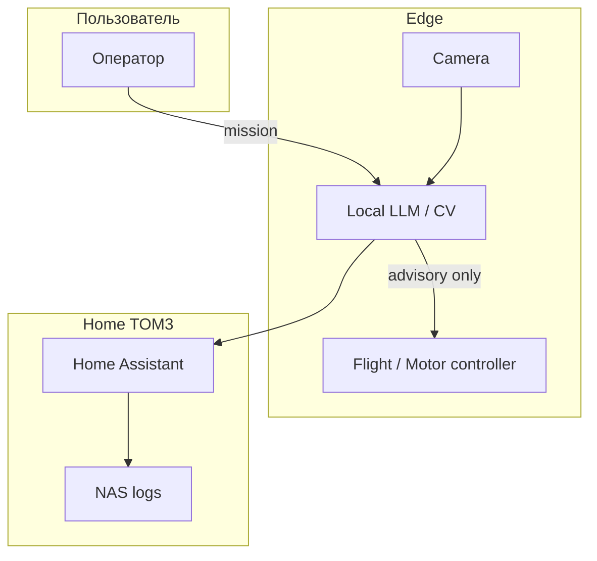
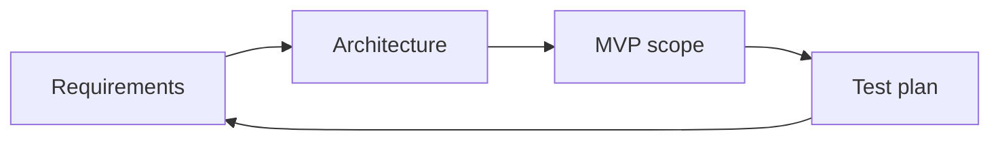

# ENGINEERING ROADMAP
## Том 5 · Лаборатория №5 — Проектирование систем

> **🟣 Архитектор технологий** · Миссия дня

---

## 📡 История

**CAD** (Лаб. №4) дал **деталь**. **Локальный ИИ**, **дрон**, **3D-печать** — **куски**. Системный инженер из **Тома 3** уже собирал **NAS + Pi-hole + HA + VPN** в **одну** инфраструктуру. **Архитектор технологий** делает **то же** на **уровне продукта**: **железо + софт + данные + люди + этика**. Сегодня — **system design** без buzzwords: **требования**, **диаграммы**, **отказы**, **границы** — как **README** для **финального** проекта Тома 5.

---

## 🚀 Миссия

**Спроектировать** документ `system_design_v1.md` для **многосоставной** системы (дрон / робот / умная станция) с **диаграммами**, **NFR** и **планом** MVP.

---

## 🎯 Цель

- **написать** **≥ 5** функциональных и **≥ 3** нефункциональных требований;
- **нарисовать** **C4 / block** diagram (Mermaid) **≥ 2** уровней;
- **описать** **3** сценария отказа и **mitigation**.

**Результат:** `~/Moja_Laboratoria/T5/system_design_v1.md` — **основа** для Лаб. №9.

---

## ⏱ Время

3–4 часа (можно **3 дня** по 60 min).

---

## 🧰 Что понадобится

- [ ] Опыт Томов 1–4 + Лаб. №0–4 Тома 5
- [ ] Текстовый редактор + Mermaid (VS Code / Obsidian / GitHub preview)
- [ ] Блокнот для **stakeholder** интервью (сам с собой)
- [ ] dnevnik.txt

---

## 🤔 Как ты думаешь?

**Не читай ответ сразу.**

1. Что **важнее** для **дронa-разведчика**: **скорость** или **время** полёта?
2. Если **Ollama упал**, должна ли **система** **продолжать** базовый режим?
3. Кто **пользователь** системы — **ты**, **родитель**, **учитель**? **Конфликт** требований?

*(Запиши в dnevnik.)*

**Настоящее объяснение:** **System design** — **договор** между **целями** и **реальностью**. **NFR** (latency, privacy, uptime) часто **убивают** «крутые» фичи. **Failure modes** — **не** pessimism, а **профессионализм**. **Этика ИИ** — **NFR**: «**human-in-the-loop** для решений с **риском**».

---

## 💡 Аналогия

**Система** = **оркестр**: **скрипки** (CV), **барабаны** (моторы), **дирижёр** (контроллер), **партитура** (ваш design doc). Без **партитуры** — **шум**.

| В жизни | System design |
|---------|----------------|
| ТЗ на кухню | **Requirements** |
| План дома | **Block diagram** |
| Запасной выход | **Fallback / degrade** |
| Пожарный план | **Failure modes** |
| GDPR | **Privacy NFR** |

### 😲 ВАУ!

**Apollo Guidance Computer** — **74 KB** памяти — **system design** с **жёсткими** лимитами **спас** миссии. **Твой** Pi **мощнее** — **ответственность** **больше**, не меньше.

### 😄 Момент улыбки

Диаграмма **«всё стрелочками к облаку»** — **архитектура** стажёра. **Архитектор** рисует **границы** и **отказы**.

---

## 📷 Иллюстрация

📷 **[Для художника]** `ILL-T5-L5-01` · Стол: **большой** лист **system map** (блоки Pi, Ollama, FC, Camera, HA); подросток **соединяет** стикерами; **красные** стикеры «SPOF»; ноутбук — **Mermaid**; badge 🟣. Подпись: *«Сначала схема — потом пайка»*.

---

## 📊 Mermaid





---

## 🔬 Эксперимент

**Правило:** минимум **№1–5**.

---

### Эксперимент 1 — «Выбор системы для проекта»

**⏱** 20 min

Выбери **одну** (для Лаб. №9):

| Вариант | Состав |
|---------|--------|
| A | **Ground robot** + CV + локальный ИИ + HA |
| B | **Drone scout** (sim OK) + geofence + logging |
| C | **Edge station** (Pi) + sensors + 3D-printed enclosure |

Запиши **1 абзац** «зачем миру **ещё один** такой прототип» — **честно**.

**✅ Проверь себя:** выбор **A/B/C** **зафиксирован** в dnevnik.

---

### Эксперимент 2 — «Functional requirements»

**⏱** 30 min

`system_design_v1.md` раздел **FR** — **≥ 5** пунктов в формате:

```
FR-3: Оператор SHALL видеть telemetry (battery, link) ≤ 2 s delay.
```

Используй **SHALL** / **SHOULD** (RFC style упрощённо).

**✅ Проверь себя:** **≥ 5 FR**, каждый **проверяемый**.

---

### Эксперимент 3 — «Non-functional: privacy, safety, AI ethics»

**⏱** 25 min

**NFR** **≥ 3**:

```
NFR-P1: Video SHALL NOT leave LAN without explicit toggle.
NFR-S1: Motor ARM SHALL require physical + software interlock.
NFR-AI1: Lethal / harmful commands SHALL be blocked at policy layer.
```

**✅ Проверь себя:** **≥ 1 NFR** про **ИИ/приватность**.

---

### Эксперимент 4 — «C4 Context + Container»

**⏱** 40 min

Два Mermaid:

1. **Context** — система и **внешние** акторы.
2. **Container** — **Pi**, **FC**, **Ollama**, **DB/logs**.

**✅ Проверь себя:** **2** диаграммы **в файле**; **стрелки** подписаны **протоколом** (MQTT, UART, HTTP).

---

### Эксперимент 5 — «Failure modes (FMEA-lite)»

**⏱** 30 min

Таблица **≥ 3** строк:

| Комponent | Failure | Effect | Mitigation |
|-----------|---------|--------|------------|
| Ollama | OOM | No AI hints | Degrade to manual |
| LiPo | Cell low | Crash | RTL + buzzer |
| Wi-Fi | Loss | No HA | Local log buffer |

**✅ Проверь себя:** **mitigation** **не** «надеяться».

---

### Эксперимент 6 — «MVP vs v2 scope»

**⏱** 20 min *(рекомендуется)*

Две колонки:

- **MVP** (Лаб. №9 за 2 недели) — **≤ 5** фич.
- **v2** — **мечты** **без** обязательства.

**✅ Проверь себя:** MVP **реалистичен** с **твоим** железом.

---

## ⚠ Типичные ошибки

| Ошибка | Как исправить |
|--------|---------------|
| **Feature soup** | **MVP** **≤ 5** |
| Нет **NFR** | Privacy **обязательна** |
| «Облако решит» | **Edge** default |
| **SPOF** без плана | **Fallback** |
| ИИ **без** policy | NFR-AI **в design** |
| Диagram **без** легенды | Подписи **на** стрелках |

---

## 🧪 Проверь себя

- [ ] system_design_v1.md **≥ 2** страницы экв.
- [ ] FR **≥ 5**, NFR **≥ 3**
- [ ] **2** Mermaid уровня
- [ ] FMEA **≥ 3** строк
- [ ] MVP **выделен**
- [ ] **Этика ИИ** в **NFR**

---

## 📝 Запись в инженерный dnevnik

```
=== LAB №5 (TOM 5) ===
Data: ___
System choice A/B/C: ___
Top 3 FR:
Top NFR (privacy/AI):
Biggest failure mode:
MVP (5 bullets max):
Następny krok:
```

---

## 🏆 Что теперь умеешь

- [ ] **Писать** проверяемые **требования**
- [ ] **Рисовать** **architecture** **2** уровней
- [ ] **Планировать** **degradation** при отказах
- [ ] **Встраивать** **этику ИИ** в **NFR**
- [ ] **Готовить** **фундамент** финального проекта

---

## ➡ Что дальше

**Следующий файл:** `06_LAB_MEHATRONIKA.md` — **Лаборатория №6:** **сшить** механику, электронику и код **в одном** цикле.

**Перед переходом:**

- [ ] system_design_v1 — **обязательно**
- [ ] MVP scope — **обязательно**
- [ ] LAB №5 — **обязательно**

### 🔮 Вопрос без ответа

На **схеме** всё **красиво**. **Где** **физически** **встречаются** **мотор**, **редуктор** и **датчик** — и **кто** **синхронизирует** **1 kHz** PWM с **30 Hz** камеры?

**Ответ — в Лаборатории №6.**

---

*Не пиши код. **Сначала** — **system_design_v1.md**.*
