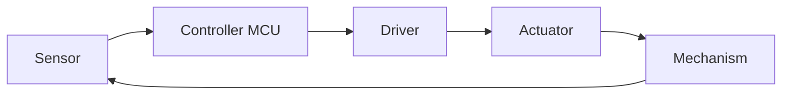
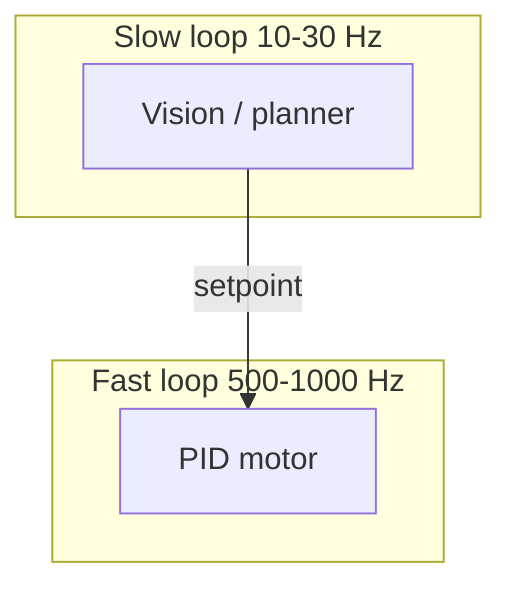

# ENGINEERING ROADMAP
## Том 5 · Лаборатория №6 — Мехатроника

> **🟣 Архитектор технологий** · Миссия дня

---

## 📡 История

**System design** (Лаб. №5) — **бумага**. **Мехатроника** — **где** **мотор** встречает **код**. Том 2 дал **GPIO, PWM, датчики**; Том 4 — **робота**; Том 5 — **CAD и дрон**. **Mechatronics** = **механика + электроника + управление + софт** в **одном** цикле **iteracji**. Сегодня — **замкнутый контур**: **encoder/sensor → controller → actuator → физика**.

---

## 🚀 Миссия

**Собрать** учебный мехатронный **узел** (servo arm / linear stage / balance bot на столе) и **задокументировать** **control loop** с **частотами** и **безопасностью**.

---

## 🎯 Цель

- **собрать** **≥ 1** actuated механизм с **обратной связью**;
- **реализовать** **PID или state machine** управления;
- **измерить** **latency** цикла и **лимиты** механики.

**Результат:** `~/Moja_Laboratoria/T5/mechatronics/loop.md` + **видео/GIF** **или** лог **≥ 10 s** стабильной работы.

---

## ⏱ Время

4–6 часов (можно **5 дней** по 45–60 min).

---

## 🧰 Что понадобится

- [ ] Arduino / ESP32 / Raspberry Pi (из Томов 2–4)
- [ ] Servo **или** DC motor + driver **или** шаговый + driver
- [ ] Датчик: **potentiometer / encoder / IMU / ultrasonic**
- [ ] Блок питания **подходящий** (не **USB** для **сильных** servo)
- [ ] Breadboard / **3D-printed** крепёж (Лаб. №3–4)
- [ ] dnevnik.txt

---

## 🤔 Как ты думаешь?

**Не читай ответ сразу.**

1. Почему **servo** на **USB 500 mA** **дёргается** при **нагрузке**?
2. **Камера 30 FPS** и **PID 1 kHz** — **один** loop **или** **два**?
3. Робот **схватил** объект **сильнее**, чем нужно — **баг** механики **или** **отсутствие** **force limit**?

*(Запиши в dnevnik.)*

**Настоящее объяснение:** Мехатроника **разделяет** **быстрые** loops (motor) и **медленные** (vision). **Питание** и **механический** **stop** — **часть** design. **ИИ** **не** заменяет **лимиты тока** и **концевики**. **Этика:** **force** на **человека** — **hard limit** **в железе**, не **в prompt**.

---

## 💡 Аналогия

**Мехатронный узел** = **рука** + **нерв** + **рефлекс**. **Мозг** (high-level) говорит «**взять**» — **спинной** контур **держит** **хват**.

| В жизни | Mechatronics |
|---------|--------------|
| Сухожилие | **Ремень / шестерня** |
| Нерв | **Encoder / IMU** |
| Рефлекс | **PID @ 500 Hz** |
| Решение «куда» | **Planner / CV** |

### 😲 ВАУ!

**Boston Dynamics** — **тысячи** часов **мехатроники** **до** «**viral**» видео. **TikTok** показывает **1%** — **PID и редуктор** — **99%**.

### 😄 Момент улыбки

Шаговый мотор **без** **limit switch** — **способ** **переписать** стол **в** **крошку**.

---

## 📷 Иллюстрация

:::illustration
ILL-T5-L6-01
:::

## 📊 Mermaid





---

## 🔬 Эксперимент

**Правило:** минимум **№1, №2, №3, №5**.

---

### Эксперимент 1 — «Механическая сборка»

**⏱** 45 min

Собери **servo + рычаг** **или** **колесо на моторе** + **3D bracket** (Лаб. №4).

Документируй:

- **Ход** (градусы / mm)
- **Max load** (ручная оценка — **не** ломай)
- **Крепёж** M3

**✅ Проверь себя:** фото **сборки**; **нет** **люфта** «на глаз **страшно**».

---

### Эксперимент 2 — «Датчик обратной связи»

**⏱** 30 min

Варианты:

- Pot на **joint** (ADC)
- **Encoder** на колесе
- **Ultrasonic** расстояние (Том 4)

Прочитай **≥ 10** значений в serial:

```cpp
// Arduino пример
void setup() { Serial.begin(115200); }
void loop() {
  Serial.println(analogRead(A0));
  delay(10);
}
```

**✅ Проверь себя:** **график** или **20 строк** log **в dnevnik**.

---

### Эксперимент 3 — «PID / position hold»

**⏱** 60 min

Удерживай **угол** / **расстояние** — **setpoint** с **pot** или **Serial**.

Запиши **Kp, Ki, Kd** и **поведение**.

| Symptom | Tune |
|---------|------|
| Oscillation | **↓ Kp**, **↑ Kd** |
| Slow | **↑ Kp** |
| Offset | **↑ Ki** careful |

**✅ Проверь себя:** **10 s** **удержания** **без** **runaway**.

---

### Эксперимент 4 — «Dual-loop timing»

**⏱** 25 min *(рекомендуется)*

На бумаге **или** код:

- **Timer1** 1 ms → motor PID
- **main** / **Timer2** 100 ms → **print** sensor

**✅ Проверь себя:** **частоты** **записаны** в loop.md.

---

### Эксперимент 5 — «Safety interlocks»

**⏱** 20 min

`loop.md` раздел **Safety**:

- **E-stop** (кнопка → **cut motor**)
- **Software** max PWM **≤ 70%**
- **Timeout:** нет **sensor** 500 ms → **stop**
- **AI:** CV **не** **напрямую** на **PWM** — **only** setpoint **± limit**

**✅ Проверь себя:** **≥ 4** правила; **E-stop** **протестирован**.

---

### Эксперимент 6 — «Интеграция с system_design»

**⏱** 20 min

Обнови **system_design_v1.md**: блок **Mechatronics node** с **реальными** **частотами** и **питанием**.

**✅ Проверь себя:** **1** абзац **delta** в design doc.

---

## ⚠ Типичные ошибки

| Ошибка | Как исправить |
|--------|---------------|
| **USB** power для **big servo** | **Внешний** PSU **общая** земля |
| **No E-stop** | **Кнопка** **физически** |
| PID **без** sensor filter | **Moving avg** |
| **Backlash** игнор | **Preload** / **пружина** |
| CV → **direct PWM** | **Limiter** + **human** |
| **Floating** GPIO | **Pull-up/down** |

---

## 🧪 Проверь себя

- [ ] Сборка + sensor **работают**
- [ ] PID **hold** **≥ 10 s**
- [ ] loop.md **+ safety**
- [ ] **Dual-loop** **описан**
- [ ] Design doc **обновлён**

---

## 📝 Запись в инженерный dnevnik

```
=== LAB №6 (TOM 5) ===
Data: ___
Uzel (servo/motor):
Sensor:
PID Kp/Ki/Kd:
E-stop test: TAK/NIE
Max PWM limit: ___%
Następny krok:
```

---

## 🏆 Что теперь умеешь

- [ ] **Собрать** actuated узел с **feedback**
- [ ] **Настроить** PID **практически**
- [ ] **Разделить** fast/slow **loops**
- [ ] **Встроить** **safety** **до** автonomii
- [ ] **Связать** механику с **system design**

---

## ➡ Что дальше

**Следующий файл:** `07_LAB_KOSMOS.md` — **Лаборатория №7:** инженерия **за** **Kármán line**.

**Перед переходом:**

- [ ] PID + safety — **обязательно**
- [ ] loop.md — **обязательно**
- [ ] LAB №6 — **обязательно**

### 🔮 Вопрос без ответа

Твой **узел** работает **на столе**. **Что** меняется, когда **g → 0** и **нет** **воздуха** для **охлаждения**?

**Ответ — в Лаборатории №7.**

---

*Отключи мотор **кнопкой**. **Потом** — **ещё** один **PID** прогон.*
