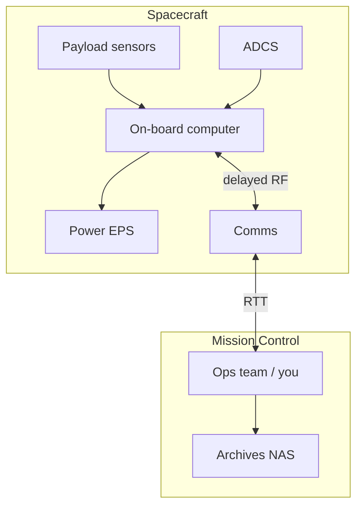
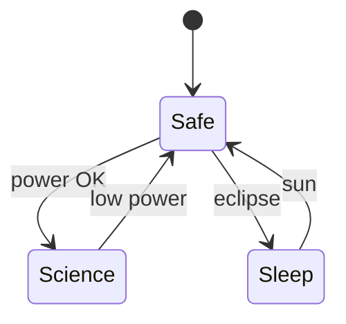

# ENGINEERING ROADMAP
## Том 5 · Лаборатория №7 — Космос

> **🟣 Архитектор технологий** · Миссия дня

---

## 📡 История

**Мехатроника** (Лаб. №6) — **земная** гравитация, **воздух**, **розетка** рядом. **Космос** **меняет** **все** **допущения**: **vacuum**, **радиация**, **thermal**, **delay**, **single failure = mission loss**. Ты **не** обязан **летать** — но **архитектор** **должен** **читать** **миссии** как **system design** **на максимуме**. Сегодня — **орбитальная** лаборатория **на столе**: **телеметрия**, **link budget**, **этика** **dual-use** и **деbris**.

---

## 🚀 Миссия

**Смоделировать** мини-миссию (CubeSat-style / Mars rover sim) с **телеметрией**, **задержкой** и **mission ops** документом.

---

## 🎯 Цель

- **понять** **subsystems** космического аппарата (power, comms, ADCS, payload);
- **реализовать** **delayed telemetry** **через** скрипт **или** симулятор;
- **написать** **ops playbook** **≥ 1** anomaly.

**Результат:** `~/Moja_Laboratoria/T5/space/mission_ops.md` + **лог** **≥ 20** telemetry packets.

---

## ⏱ Время

3–5 часов (можно **4 дня** по 45 min).

---

## 🧰 Что понадобится

- [ ] ПК + Python (Том 1, Лаб. №0)
- [ ] Опционально: **Kerbal Space Program** / **OpenRocket** / **NASA Eyes**
- [ ] Опционально: ESP32 **как** «спутник» на **столе**
- [ ] dnevnik.txt

---

## 🤔 Как ты думаешь?

**Не читай ответ сразу.**

1. Почему **Mars** **rover** **не** **управляют** **джойстиком** **real-time**?
2. **Solar panel** **+** **eclipse** — **что** **отключить** **первым**?
3. **Спутник** с **ИИ** **автономного** **maneuver** — **кто** **отвечает** **за** **debris**?

*(Запиши в dnevnik.)*

**Настоящее объяснение:** **Light-time delay** → **autonomy** + **planning**. **Power budget** → **режимы** **safe** / **science** / **sleep**. **Space ethics:** **deorbiting**, **не** **мусорить** orbit, **dual-use** **технологии** (навигация **vs** **weaponization**) — **инженер** **осознан**.

---

## 💡 Аналогия

**Космический аппарат** = **подводная лодка** **без** **возможности** **всплыть** **починить** **USB**. **Mission Control** = **Том 3** **NOC**, но **ping** **минуты**, **не** **ms**.

| В жизни | Космос |
|---------|--------|
| Wi‑Fi дома | **Deep Space Network** |
| UPS | **Battery + eclipse** |
| `ping google` | **Round-trip light time** |
| Docker restart | **Safe mode reboot** |
| GDPR | **Planetary protection** |

### 😲 ВАУ!

**Voyager** **still** **отправляет** **данные** — **< 1 W** **transmitter**, **delay** **> 20 h**. **Инженерия** **терпения**.

### 😄 Момент улыбки

«**Перезагрузи** **спутник** **Ctrl+Alt+Del**» — **если** **работает**, **ты** **либо** **гений**, **либо** **создал** **debris**.

---

## 📷 Иллюстрация

📷 **[Для художника]**

**ID:**  
ILL-T5-L7-01

**Название:**  
Далеко — значит автономно

**Тип иллюстрации:**  
Сюжетная сцена · CubeSat на столе · Mission Control UI · Земля в окне · задержка связи

**Главная цель иллюстрации:**  
Показать **космическую** инженерию **на столе**: аппарат (CubeSat) + **Mission Control** (телеметрия: battery, temp, link) + **round-trip delay** (12 min как **визуальная** идея, **без** цифр) + **Земля** в окне. Зритель понимает: **далеко** → **автономия**, **не** джойстик real-time.

Что читатель должен почувствовать: **терпение Voyager**, ответственность за **debris** и **dual-use**, масштаб **system design** Тома 3 на максимуме.

---

**Описание сцены**

**Комната** героя **вечером**. **Стол:**

**CubeSat** (10×10×10 cm стиль) — **3D-модель** или **макет**: **солнечные панели** сложены, **антенна** сбоку, **корпус** серебристый. Стоит на **маленькой** подставке.

**Главный монитор — Mission Control dark UI:**  
- **Три** круговых gauge: **battery** (зелёный ~70%), **temperature** (синий), **link** (жёлтый, **мигающий** «слабый») — **без** цифр, только **дуги**  
- **Полоса** «связь Земля ↔ спутник» с **длинной** пунктирной линией и **иконками** планет на концах  
- **Индикатор задержки:** **песочные часы** или **две** часовые стрелки с **большим** углом между ними (намёк RTT 12 min — **без** текста «12 min»)

**Второй экран** — **график** телеметрии (линия battery за время).

**Окно** слева — **ночное небо**, **стилизованная Земля** на горизонте (синий шар с **белыми** облаками — **не** NASA фото).

**Герой** (17–18 лет) **в профиль** — пишет в **тетрадь** ops playbook или смотрит на **link** gauge. **Наушники** на шее. Badge 🟣 **крупно**.

**На полке:** модель **Mars rover** игрушечная, книга по космосу **без** названия.

**Что НЕ должно появляться:** взрывы, dead astronauts, военные спутники, классифицированные логотипы, Star Wars.

---

**Главный герой**

- **Возраст:** 17–18 лет  
- **Внешность:** узнаваемый герой  
- **Поза:** сидит, **сосредоточен** на телеметрии  
- **Взгляд:** на экран Mission Control  

---

**Дополнительные персонажи**

Нет.

---

**Окружение**

- **Тип:** «мини-NOC» дома (callback Том 3)  
- **Детали:** CubeSat, тёмный UI, Земля в окне, тетрадь `mission_ops.md`  

---

**Композиция**

- **Формат:** 16:9  
- **План:** средний — герой, стол, окно  
- **Фокус:** CubeSat + gauges + линия задержки  
- **Линия взгляда:** спутник → gauges → Земля в окне  

---

**Освещение**

- **Тип:** тёмная комната + **экранный** свет + **холодный** лунный из окна  
- **Атмосфера:** **Mission Control** дома, **не** кино Apollo 13  

---

**Цветовая палитра**

- **Основные:** `#1D3557` (dark UI), `#7B2CBF` (badge), `#2D6A4F` (battery OK), `#457B9D` (Земля)  
- **Акцент:** жёлтый **слабый** link  

---

**Стиль**

**EduMost** · вектор · **тёмный UI** как в учебных infographics · **без** фотореализма NASA.

---

**Возрастная адаптация**

- **Возраст читателя:** 15–18 лет  
- **Нельзя:** катастрофы, кровь, militarization  

---

**Формат**

SVG · 16:9 · высокая детализация

---

**Текст**

**Без текста** на artwork. Подпись *«Далеко — значит автономно»* — под рисунком.

---

**Негативный prompt**

водяные знаки · подписи · NASA логотип · взрывы · мёртвые космонавты · оружие · артефакты AI · аниме · фотореализм

---

**Связь с лабораторией**

Лаборатория №7 — `mission_ops.md`, delayed telemetry, power budget, **этика** debris. Иллюстрация — **ops** на столе: ping **минуты**, не ms.

---

## 📊 Mermaid





---

## 🔬 Эксперимент

**Правило:** минимум **№1, №2, №3, №5**.

---

### Эксперимент 1 — «Subsystem map»

**⏱** 30 min

`mission_ops.md`:

| Subsystem | Function | Failure |
|-----------|----------|---------|
| EPS | Power | Brownout |
| COM | Link | Loss of signal |
| ADCS | Pointing | Tumble |
| TTC | Command | Wrong opcode |
| PL | Science | Noise |

**✅ Проверь себя:** **≥ 5** subsystems.

---

### Эксперимент 2 — «Telemetry simulator»

**⏱** 45 min

`~/Moja_Laboratoria/T5/space/telemetry_sim.py`:

```python
import json, time, random
for i in range(25):
    pkt = {
        "mission_time_s": i * 60,
        "battery_v": round(7.4 - i*0.01 + random.uniform(-0.02, 0.02), 2),
        "temp_c": round(20 + random.uniform(-2, 5), 1),
        "signal_dbm": round(-90 + random.uniform(-5, 5), 1),
    }
    print(json.dumps(pkt))
    time.sleep(0.2)  # ускоренно; для Mars добавь time.sleep(720) в комментарии
```

```bash
python3 ~/Moja_Laboratoria/T5/space/telemetry_sim.py | tee ~/Moja_Laboratoria/T5/space/tm.log
```

**✅ Проверь себя:** **≥ 20** строк **в** tm.log.

---

### Эксперимент 3 — «Light-time delay»

**⏱** 25 min

Добавь **функцию** `mars_rtt_min = 4` **to** `22` **в** **зависимости** от **opposition**.

**Упражнение:** команда «**поверни** **solar** **panel**» → **ответ** **через** **RTT/2** **min** **в** sim.

**✅ Проверь себя:** **1** **абзац** **в** dnevnik: **почему** **autonomy** **обязательна**.

---

### Эксперимент 4 — «OpenRocket / KSP / NASA Eyes»

**⏱** 45 min *(рекомендуется)*

**Один** **из**:

- **OpenRocket:** **стability** **margin**
- **KSP:** **orbit** **insertion** **Δv** **запись**
- **NASA Eyes:** **скрин** **миссии** **+** **1** **факт**

**✅ Проверь себя:** **скрин** **+** **caption** **в** mission_ops.

---

### Эксперимент 5 — «Anomaly playbook»

**⏱** 30 min

Сценарий: **battery_v < 7.0** **3** **packets** **подряд**.

**Playbook:**

1. **Detect**
2. **Safe mode** (отключить payload)
3. **Notify** ops
4. **Log** to NAS (Том 3)
5. **Review** post-mortem

**Этика:** **autonomous** **deorbit** **ИИ** — **только** **с** **human** **approval** **на** **Земле**.

**✅ Проверь себя:** **5** **шагов** **numbered**.

---

### Эксперимент 6 — «Space + local AI»

**⏱** 20 min *(рекомендуется)*

**Paper design:** **Ollama** **на** **Земле** **не** **управляет** **thrusters** **real-time** — **only** **plan** **upload** **batch**.

**✅ Проверь себя:** **NFR** **в** **1** **абзаце**.

---

## ⚠ Типичные ошибки

| Ошибка | Как исправить |
|--------|---------------|
| **Real-time** **ожидание** **Mars** | **Plan** **blocks** |
| **Ignore** **thermal** | **Model** **temp** **telemetry** |
| **No** **safe** **mode** | **Default** **Safe** |
| **Kessler** **who cares** | **Deorbit** **plan** |
| **ИИ** **=** **auto** **maneuver** | **Human** **gate** |
| **Секретные** **TLE** **в** **Git** | **Не** **commit** |

---

## 🧪 Проверь себя

- [ ] mission_ops.md **готов**
- [ ] tm.log **≥ 20** packets
- [ ] Delay **объяснён**
- [ ] Anomaly playbook **5** steps
- [ ] **Этика** **debris/AI** **1** **абзац**

---

## 📝 Запись в инженерный dnevnik

```
=== LAB №7 (TOM 5) ===
Data: ___
Mission name: ___
RTT (sim): ___ min
Anomaly trained:
Space ethics (1 zdanie):
Następny krok:
```

---

## 🏆 Что теперь умеешь

- [ ] **Читать** **космическую** **миссию** как **system**
- [ ] **Симулировать** **telemetry** **и** **delay**
- [ ] **Писать** **ops** **playbook**
- [ ] **Связать** **NAS** **logging** **(T3)** **с** **ops**
- [ ] **Обсуждать** **этику** **orbit** **и** **AI**

---

## ➡ Что дальше

**Следующий файл:** `08_LAB_AVIACIJA.md` — **Лаборатория №8:** **атмосфера**, **аэродинамика**, **сертификация**.

**Перед переходом:**

- [ ] telemetry + playbook — **обязательно**
- [ ] LAB №7 — **обязательно**

### 🔮 Вопрос без ответа

**CubeSat** **в** **vacuum**. **Самолёт** **в** **air**. **Общее** **между** **орбитой** **и** **крылом** — **кроме** **«летает»**?

**Ответ — в Лаборатории №8.**

---

*Запусти **telemetry_sim**. **Подожди** **RTT** — **даже** **в** **sim** **учит** **терпению**.*
