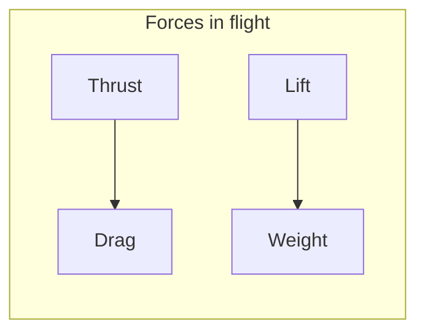
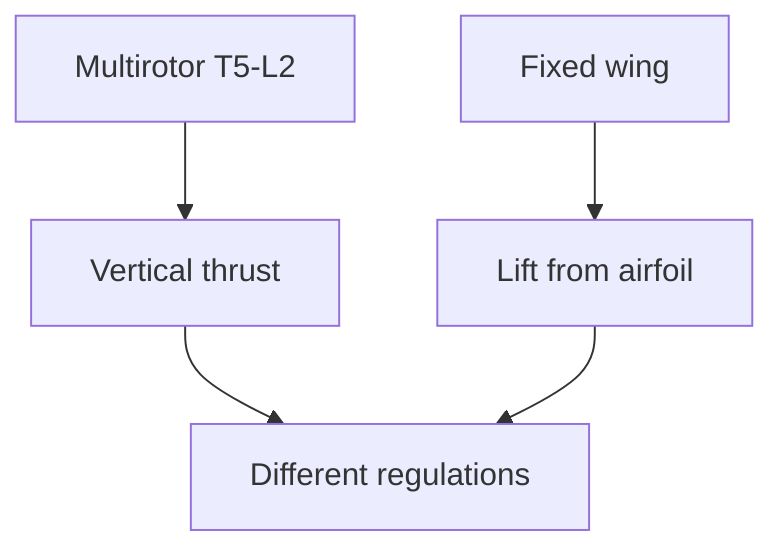

# ENGINEERING ROADMAP
## Том 5 · Лаборатория №8 — Авиация

> **🟣 Архитектор технологий** · Миссия дня

---

## 📡 История

**Дрон** (Лаб. №2) — **малый** **БПЛА**. **Космос** (Лаб. №7) — **нет** **атмосферы**. **Авиация** — **между**: **крыло**, **подъёмная** **сила**, **сертификация**, **ATC**, **человеческие** **жизни** **в** **cabine**. **Архитектор** **видит** **continuum**: **quad** → **fixed-wing** → **jet** → **orbit**. Сегодня — **аэродинамика** **на** **интуиции** **+** **расчёт**, **checklist** **culture** **и** **этика** **автономных** **систем** **в** **гражданском** **воздухе**.

---

## 🚀 Миссия

**Построить** **авiation engineering pack**: **поляры** **крыла** (теория/XFLR5/бумага), **weight & balance**, **preflight** **checklist** **и** **связь** **с** **дроном** **из** **Лаб.** **№2**.

---

## 🎯 Цель

- **объяснить** **lift / drag / stall** **без** **формул** **only**;
- **сделать** **расчёт** **W&B** **или** **CG** **для** **учебного** **planera** / **мodel**;
- **сравнить** **regulatory** ** mindset** **авиации** **и** **hobby** **drones**.

**Результат:** `~/Moja_Laboratoria/T5/aviation/aviation_pack.md` + **диagram** **сил** **на** **крыле**.

---

## ⏱ Время

3–4 часа (можно **3 дня** по 50 min).

---

## 🧰 Что понадобится

- [ ] Бумага, **калькулятор**
- [ ] Опционально: **XFLR5**, **Aviation calculator app**
- [ ] Опционально: **RC** **trainer** **или** **flight sim** (MSFS / X-Plane)
- [ ] Знания **Лаб.** **№2** (drones)
- [ ] dnevnik.txt

---

## 🤔 Как ты думаешь?

**Не читай ответ сразу.**

1. **Почему** **самолёт** **не** **падает**, **хотя** **весит** **тонны**?
2. **Stall** — **это** **поломка** **моторa** **или** **угла** **атаки**?
3. **Автопилот** **Boeing** **+** **sensor** **fault** — **вина** **ИИ** **или** **процедуры** **экипажа**?

*(Запиши в dnevnik.)*

**Настоящее объяснение:** **Lift** **≈** **изменение** **импульса** **потока** **(упрощённо)**. **Stall** — **потеря** **плавного** **обтекания** **при** **высоком** **α**. **Aviation** **culture** = **checklists**, **CRM**, **redundancy**. **ИИ** **в** **cockpit** — **assist**, **не** **replace** **accountability** **pilot** **+** **manufacturer**.

---

## 💡 Аналогия

**Крыло** = **ладонь** **из** **окна** **машины** **на** **скорости**: **наклон** **вверх** — **рука** **летит** **вверх**. **Слишком** **круто** — **срыв** **потока** (**stall**).

| В жизни | Авиация |
|---------|---------|
| Плавать в воде | **Lift** **в** **воздухе** |
| Резина на асфальте | **Drag** |
| Нос в гору | **Pitch / AoA** |
| ПДД | ** FAR / EASA / ULM rules** |
| Дрон geofence | **TFR / NOTAM** |

### 😲 ВАУ!

**787** **Dreamliner** **крыло** **гнётся** **на** **метры** **в** **полёте** — **и** **это** **норма**, **не** **поломка**.

### 😄 Момент улыбки

«**ИИ** **посадит** **сам**» **без** **checklist** — **сначала** **посадит** **репутацию** **стартапа**.

---

## 📷 Иллюстрация

:::illustration
ILL-T5-L8-01
:::

## 📊 Mermaid





---

## 🔬 Эксперимент

**Правило:** минимум **№1, №2, №3, №5**.

---

### Эксперимент 1 — «Силы на крыле (diagram)»

**⏱** 25 min

Нарисуй **profile** **airfoil** + **4** **vectors** **L, D, W, T**.

**Cruise:** **L=W**, **T=D**.

**Climb:** **T > D**, **L ≥ W**.

**✅ Проверь себя:** **3** **режима** **на** **одном** **листе**.

---

### Эксперимент 2 — «Stall concept»

**⏱** 20 min

**Бумажный** **эксперимент** **или** **sim:**

- **Плавный** **α** → **lift** **растёт**
- **Critical** **α** → **buffet** / **drop** (**stall**)

Запиши: **stall** **≠** **engine** **fail**.

**✅ Проверь себя:** **1** **предложение** **«что** **делает** **pilot** **at** **stall»**.

---

### Эксперимент 3 — «Weight & Balance»

**⏱** 35 min

**Учебная** **таблица** **(model** **glider** **600g** **example):**

| Item | Mass g | Arm cm | Moment |
|------|--------|--------|--------|
| Wing | 200 | 0 | 0 |
| Fuselage | 250 | 2 | 500 |
| Battery | 150 | -5 | -750 |
| **CG** | | | **ΣM/Σm** |

**Target CG:** **25–33%** **MAC** **(запиши** **%** **получилось).

**✅ Проверь себя:** **CG** **вычислен**; **вне** **envelope** **→** **перекладка** **battery**.

---

### Эксперимент 4 — «XFLR5 или sim flight»

**⏱** 45 min *(реkomenduется)*

**XFLR5:** **Cl** **vs** **α** **для** **NACA** **0012** **—** **скрин**.

**Sim:** **3** **полёта** **traffic** **pattern** **—** **запиши** **airspeed** **на** **final**.

**✅ Проверь себя:** **скрин** **или** **log** **3** **numbers**.

---

### Эксперимент 5 — «Aviation checklist culture»

**⏱** 25 min

`aviation_pack.md`:

**Preflight** **≥ 10** **items** **(CASA/FAA-style** **упрощённо):**

- Documents
- Control surfaces
- Fuel / battery
- Weather / NOTAM
- **IMSAFE** **(pilot** **fitness**)

**Bridge** **to** **drones:** **какие** **5** **пунктов** **общие**?

**Этика** **ИИ:** **autoland** **requires** **certified** **sensor** **suite** — **не** **webcam** **+** **YOLO**.

**✅ Проверь себя:** **≥ 10** **aviation** **+** **5** **shared** **with** **drone**.

---

### Эксперимент 6 — «From aviation to final project»

**⏱** 20 min

Обнови **system_design_v1.md**: **если** **система** **летает** — **добавь** **W&B** **или** **T/W** **+** **regulatory** **note**.

**✅ Проверь себя:** **delta** **paragraph** **в** **design**.

---

## ⚠ Типичные ошибки

| Ошибка | Как исправить |
|--------|---------------|
| **Lift** **=** **«вентилятор** **вниз»** **only** | **Airfoil** **concept** |
| **Игнор** **CG** | **Calculate** |
| **Дрон** **=** **самолёт** **regs** | **Separate** **tables** |
| **Sim** **=** **real** **skills** | **Checklist** **still** |
| **CV** **autoland** **day** **1** | **Human** **+cert** |
| **Fly** **near** **airport** | **Check** **maps** |

---

## 🧪 Проверь себя

- [ ] aviation_pack.md **complete**
- [ ] **Forces** **diagram**
- [ ] **W&B** **or** **CG** **calc**
- [ ] **Stall** **explained**
- [ ] **Checklist** **≥ 10**
- [ ] **Link** **to** **Lab** **2** **+** **design** **doc**

---

## 📝 Запись в инженерный dnevnik

```
=== LAB №8 (TOM 5) ===
Data: ___
CG result (% MAC or cm):
Stall in my words:
Shared checklist items drone+plane: ___
AI autoland opinion (2 zdania):
Następny krok:
```

---

## 🏆 Что теперь умеешь

- [ ] **Объяснить** **lift/drag/stall**
- [ ] **Считать** **простой** **W&B**
- [ ] **Применять** **checklist** **culture**
- [ ] **Различать** **regs** **drone** **vs** **manned**
- [ ] **Готовить** **финальный** **проект** **с** **aero** **mindset**

---

## ➡ Что дальше

**Следующий файл:** `09_LAB_FINALNY_PROEKT.md` — **Лаборатория №9:** **большой** **инженерный** **проект** — **финал** **50** **лабораторий**.

**Перед переходом:**

- [ ] aviation_pack — **обязательно**
- [ ] checklist — **обязательно**
- [ ] LAB №8 — **обязательно**

### 🔮 Вопрос без ответа

**Восемь** **лабораторий** **Тома** **5** **+** **четыре** **тома** **за** **спиной**. **Готов** **ли** **ты** **сшить** **всё** **в** **одну** **систему**, **которую** **не** **стыдно** **показать** **университету** **или** **работодателю**?

**Ответ — в Лаборатории №9.**

---

*Распечатай **checklist**. **Отметь** **галочки** **карандашом** — **как** **настоящий** **пилот**.*
