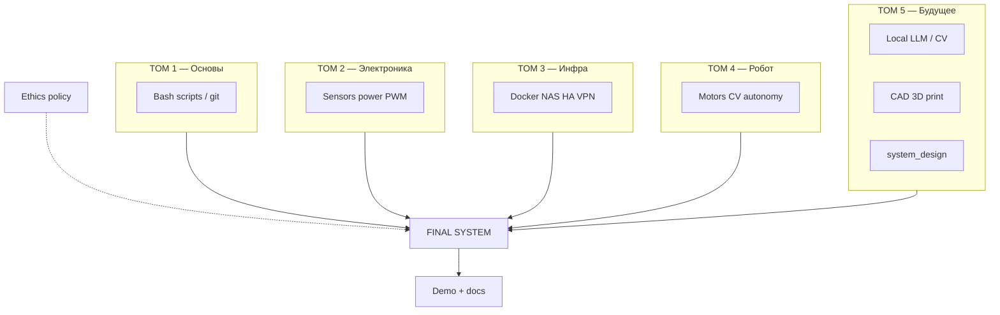
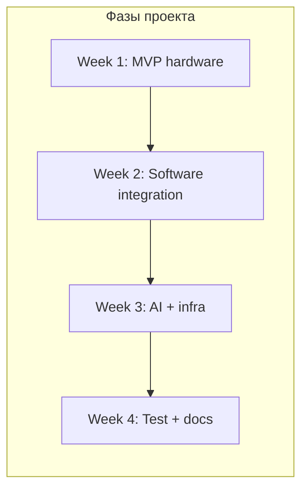

# ENGINEERING ROADMAP
## Том 5 · Лаборатория №9 — Большой инженерный проект

> **🟣 Проект уровня 5 · Архитектор технологий** · Миссия дня

---

## 📡 История

**Пятьдесят лабораторий**. **Пять уровней**. **Пять больших проектов.**

| Том | Проект уровня | Что ты уже доказал |
|-----|---------------|-------------------|
| 🟢 1 | Minecraft-сервер | Компьютер, Linux, сеть, bash |
| 🔵 2 | Метеостанция | GPIO, датчики, питание, ESP32 |
| 🟠 3 | Домашняя инфраструктура | Docker, NAS, VPN, Home Assistant |
| 🔴 4 | Автономный робот | Arduino/Pi, CV, моторы |
| 🟣 5 | **Твоя система сегодня** | ИИ, CAD, 3D, дрон, космос, авиация — **сшить всё** |

Лаборатории №0–8 Тома 5 дали **кирпичи**: **локальный ИИ**, **БПЛА**, **печать**, **CAD**, **system design**, **мехатроника**, **mission ops**, **авиационная** дисциплина. Это **не** экзамен по **списку технологий**. Это **диплом Архитектора**: **одна** работающая система с **документацией**, **этикой**, **отказоустойчивостью** и **демо**, которое **понятно** инженеру **и** человеку **без** доступа к твоему ноутбуку.

---

## 🚀 Миссия

**Собрать, задокументировать и продемонстрировать** полностью автономную (в заданных границах) **инженерную систему**, использующую **навыки всех пяти томов**, с **локальным ИИ или CV**, **физическим** компонентом и **инфраструктурным** слоем.

---

## 🎯 Цель

- **реализовать** MVP из `system_design_v1.md` (Лаб. №5) **≥ 80%** FR;
- **интегрировать** **минимум 4 домена**: софт (T1/T3), электроника/мехатроника (T2/T4/T5-L6), **CAD/3D** (T5-L3–4), **ИИ/CV локально** (T5-L0–1);
- **написать** `FINAL_README.md` + **видео/демо 3–5 min** + **post-mortem** готовности.

**Результат:** репозиторий или папка `~/Moja_Laboratoria/T5/FINAL_PROJECT/` с кодом, схемами, STLs, **политикой этики ИИ**, **логами** и **записью LAB №9** в dnevnik.

---

## ⏱ Время

**15–40 часов.** Можно **3–6 недель** по **5–8 ч/нед** (как **мини-thesis**). **Не** делай за одну ночь — **архитектор** **планирует**.

---

## 🧰 Что понадобится

- [ ] Всё из Лаб. №0–8 Тома 5 (**не** заглушки — **рабочие** артефакты)
- [ ] Железо по выбранному **варианту A/B/C** (см. ниже)
- [ ] 3D-печать / CAD для **корпуса** или **крепежа**
- [ ] Pi или мини-ПК для **edge** + опционально **NAS/HA** из Тома 3
- [ ] Ollama **или** OpenCV / TFLite **локально**
- [ ] Git (`git init` в проекте)
- [ ] dnevnik.txt

---

## 🤔 Как ты думаешь?

**Не читай ответ сразу.**

1. Какая **одна** функция системы **оправдывает** **весь** проект **одним** предложением для **жюри**?
2. Если **завтра** **сгорит** SD-карта — **сколько** часов **до** **восстановления** по **README**?
3. Где **human-in-the-loop** **обязателен** — **даже** если **ИИ** «**умнее**»?

*(Запиши в dnevnik **до** пайки.)*

**Настоящее объяснение:** Финальный проект **оценивается** как **система**, не **набор** хаков. **Интеграция** > **количество** buzzwords. **Этика ИИ** — **не** слайд: **policy file**, **kill switch**, **privacy NFR** **в** **работающем** **контуре**. **Архитектор** **отвечает** **словом** **и** **схемой**.

---

## 💡 Аналогия

**Финальный проект** = **первый** **спутник** **своей** **«комpanii»**: **не** **идеал**, но **летит**, **telemetria** **идёт**, **ops** **знают** **что** **делать** **при** **анomaly**.

| В жизни | Твой проект |
|---------|-------------|
| MVP продукта | **Работающий** demo |
| Runbook | **FINAL_README** |
| Board meeting | **Demo 5 min** |
| Ethics committee | **ai_policy.md** |
| Legacy | **50 lab** **в** **голове** |

### 😲 ВАУ!

Тебе **17–20**. **Typical** **student** **portfolio** — **todo** **app**. **Твой** — **edge** **robot** **+** **local** **AI** **+** **infra** **+** **CAD**. **Это** **редкий** **уровень** **—** **если** **доделаешь** **документацию**.

### 😄 Момент улыбки

«**ИИ** **делает** **всё**» **в** **README** **без** **diagram** — **архитектор** **уровня** **мем**, **не** **🟣**.

---

## 📷 Иллюстрация

:::illustration
ILL-T5-L9-01
:::

```
    T1 Linux ──► T3 HA ──► T5 Local AI
         ╲         │         ╱
          ╲        ▼        ╱
           ╲   [ FINAL ]  ╱
            ╲   SYSTEM  ╱
         T2 GPIO ──► T4 CV
```

---

## 📊 Mermaid





---

## 🔬 Эксперимент

**Правило:** это **шаги** **диплома**. Зачёт — **все №1–8** (можно **6** **недель**). **№9–10** — **уровень** **этalon**.

---

### Эксперимент 1 — «Выбор и charter проекта»

**⏱** 60 min

Скопируй шаблон:

```bash
mkdir -p ~/Moja_Laboratoria/T5/FINAL_PROJECT/{docs,src,cad,prints,logs}
cp ~/Moja_Laboratoria/T5/system_design_v1.md ~/Moja_Laboratoria/T5/FINAL_PROJECT/docs/
nano ~/Moja_Laboratoria/T5/FINAL_PROJECT/docs/CHARTER.md
```

**CHARTER.md** **обязательно**:

1. **Название** проекта
2. **One-liner** (≤ 20 слов)
3. **Вариант** A / B / C (ниже)
4. **Stakeholders** (ты, семья, школа)
5. **Success criteria** (3 **измеримых**)
6. **Out of scope** (что **НЕ** делаешь)

**Варианты системы:**

| ID | Система | Минимум доменов |
|----|---------|-----------------|
| **A** | **Edge Explorer Rover** — наземный робот, CV, local hint LLM, HA telemetry | T2+T3+T4+T5 |
| **B** | **Scout Station** — Pi + sensors + 3D enclosure + anomaly AI + NAS logs | T1+T3+T5 |
| **C** | **Simulated Mission Ops** — telemetry + delay + mech node + **physical** control panel | T1+T5+T6+T7 |

**✅ Проверь себя:** CHARTER **подписан** **датой**; **success criteria** **числовые** (напр. «latency < 2 s»).

---

### Эксперимент 2 — «Архитектура v2 (as-built)»

**⏱** 90 min

`docs/ARCHITECTURE_v2.md`:

- **Context** + **Container** Mermaid (**обнови** из Лаб. №5)
- **Таблица** **всех** **компонентов** **с** **IP/порт/питание**
- **Data flow:** sensor → process → actuate/log
- **Explicit:** что **из** **Toma** **1/2/3/4** **где** **используется**

| README | **As-built** **truth** | Drift от v1 **OK** — **запиши** **why** |

**✅ Проверь себя:** **≥ 4** **ссылки** **на** **прошлые** **тома** **по** **имени** **навыка**.

---

### Эксперимент 3 — «Физический слой: CAD + 3D + мехатроника»

**⏱** 3–6 h (растянуть)

**Обязательно:**

1. **≥ 1** **деталь** **своя** **(CAD** **Lab** **4)**
2. **Напечатана** **или** **обоснован** **аналог** **(Lab** **3)**
3. **≥ 1** **actuator** **+** **sensor** **loop** **(Lab** **6)**
4. **E-stop** **или** **software** **motor** **interlock**

**Пример A:** **корпус** **Pi** **+** **кронштейн** **камеры** **+** **servo** **scan**.

**✅ Проверь себя:** **фото** **сборки** **в** `docs/photos/`; **E-stop** **test** **video** **или** **описание**.

---

### Эксперимент 4 — «Инфраструктурный слой (TOM 3)»

**⏱** 2–4 h

**Минимум** **2** **из** **списка:**

- [ ] **Docker** **compose** **для** **сервиса** **проекта**
- [ ] **Логи** **на** **NAS** **или** `logs/` **+** **rotation**
- [ ] **Home Assistant** **entity** **(online/offline/battery)**
- [ ] **VPN** **доступ** **к** **dashboard** **(read-only)**
- [ ] **Backup** **script** **(bash** **T1)**

`docs/RUNBOOK.md` — **как** **поднять** **с** **нуля** **≤ 10** **шагов**.

**✅ Проверь себя:** **симулировал** **reboot** **сервера** — **система** **вернулась** **(или** **runbook** **исправлен).

---

### Эксперимент 5 — «Локальный ИИ / CV (TOM 5 + TOM 4)»

**⏱** 3–5 h

**Минимум** **один** **контур:**

| Контур | Пример |
|--------|--------|
| **CV** | OpenCV / TFLite: object → **MQTT** **event** |
| **LLM** | Ollama: **log** **summary** **локально** |
| **Hybrid** | CV **detect** → **LLM** **describe** **(no** **cloud)** |

**Жёстко:**

- `ai_policy.md` **в** **корне** **проекта**
- **ИИ** **не** **управляет** **motors** **напрямую** — **only** **advisory** **или** **filtered** **setpoint**
- **Blocklist** **опасных** **команд** **в** **коде** **или** **config**

**✅ Проверь себя:** **демо** **одного** **inference** **offline**; **policy** **≥ 1** **страница**.

---

### Эксперимент 6 — «Mission / aviation mindset (TOM 5 L7–8)»

**⏱** 60 min

Добавь **в** **RUNBOOK**:

- **Preflight** **checklist** **(≥ 8** **пунктов)**
- **Anomaly** **table** **(≥ 3)** **из** **Lab** **7**
- **Если** **летает/движется** — **geofence** **или** **workspace** **limit**

**✅ Проверь себя:** **checklist** **распечатан** **и** **использован** **перед** **demo**.

---

### Эксперимент 7 — «Integration test suite»

**⏱** 2 h

`src/integration_test.sh` **или** **Python** **pytest**:

| Test | Pass criteria |
|------|---------------|
| Sensor read | **≥ 10** **valid** **samples** |
| Actuator | **moves** **+** **stops** **on** **E-stop** |
| AI inference | **returns** **in** **< N** **s** |
| Log write | **file** **on** **disk** **/ NAS** |
| HA ping | **entity** **updates** **(if** **used)** |

**✅ Проверь себя:** **≥ 4** **tests** **green** **(log** **screenshot).

---

### Эксперимент 8 — «FINAL_README и demo»

**⏱** 3 h

`FINAL_README.md` **структура:**

1. **Hero** **one-liner** **+** **фото**
2. **Architecture** **(Mermaid)**
3. **Quick** **start** **10** **steps**
4. **Bill** **of** **Materials**
5. **Ethics** **&** **safety**
6. **Skills** **map** **(50** **labs** **→** **this** **project)**
7. **Known** **issues** **/ v2**

**Demo** **3–5** **min** **video** **или** **live** **для** **жюри**:

- **Problem** → **system** → **failure** **handling** → **ethics** **mention**

**✅ Проверь себя:** **чужой** **человек** **по** **README** **может** **объяснить** **что** **это** **—** **без** **тебя**.

---

### Эксперимент 9 — «Git release v1.0.0»

**⏱** 30 min *(реkomenduется)*

```bash
cd ~/Moja_Laboratoria/T5/FINAL_PROJECT
git init
git add docs src cad prints
git commit -m "FINAL PROJECT v1.0.0: MVP complete"
git tag v1.0.0
```

**✅ Проверь себя:** `git tag` **показывает** **v1.0.0**.

---

### Эксперимент 10 — «Post-mortem и путь дальше»

**⏱** 45 min *(реkomenduется)*

`docs/POSTMORTEM.md`:

- **What** **worked**
- **What** **failed**
- **Time** **estimate** **vs** **actual**
- **Ethics** **decision** **you're** **proud** **of**
- **University** **/** **career** **next** **step**

**✅ Проверь себя:** **честный** **post-mortem** **≥ 15** **строк**.

---

## ⚠ Типичные ошибки

| Ошибка | Как исправить |
|--------|---------------|
| **Новый** **проект** **с** **нуля** **игнорируя** **Lab** **0–8** | **Reuse** **artifacts** |
| **Demo** **only** **happy** **path** | **Покажи** **E-stop** **/** **degrade** |
| **No** **docs** | **README** **=** **50%** **оценки** |
| **Cloud** **AI** **без** **причины** | **Local** **first** |
| **ИИ** **→** **motor** **direct** | **Policy** **+** **limit** |
| **Scope** ** creep** | **CHARTER** **out** **of** **scope** |
| **50** **часов** **без** **sleep** | **6** **weeks** **plan** |

---

## 🧪 Проверь себя

**Обязательный** **минимум** **для** **🟣** **Архитектора:**

- [ ] CHARTER + ARCHITECTURE_v2 + FINAL_README
- [ ] **Физическая** **часть** **(3D/CAD** **+** **sensor/actuator)**
- [ ] **TOM** **3** **element** **(docker/log/HA/VPN/backup)**
- [ ] **Local** **AI** **or** **CV** **+** **ai_policy.md**
- [ ] **Integration** **tests** **≥ 4** **pass**
- [ ] **Preflight** **checklist** **used**
- [ ] **Demo** **recorded** **or** **live** **done**
- [ ] **LAB** **№9** **block** **in** **dnevnik**
- [ ] **Можешь** **назвать** **≥ 8** **лабораторий** **из** **50**, **вошедших** **в** **проект**

---

## 📝 Запись в инженерный dnevnik

```
=== LAB №9 (TOM 5) — FINAL ===
Data: ___
Project name:
Variant A/B/C:
Success criteria met (3):
TOM skills used (list):
Ethics decision:
Demo link / opis:
Hours spent vs planned:
Co bym zrobił w v2.0:
=== KONIEC 50 LABORATORII ===
```

---

## 🏆 Что теперь умеешь

- [ ] **Спроектировать** **и** **собрать** **multi-domain** **систему**
- [ ] **Документировать** **как** **production** **engineer**
- [ ] **Интегрировать** **local** **AI** **с** **этикой** **и** **limits**
- [ ] **Использовать** **CAD/3D/mechatronics** **в** **реальном** **продукте**
- [ ] **Применять** **mission/aviation** **discipline**
- [ ] **Объяснить** **путь** **от** **11** **лет** **(T1)** **до** **Архитектора** **(T5)**

---

## ➡ Что дальше

**Следующий файл:** **нет** — это **финал** **Engineering Roadmap**.

**Перед** **закрытием** **книги:**

- [ ] FINAL_README **complete** — **обязательно**
- [ ] Demo **done** — **обязательно**
- [ ] POSTMORTEM — **обязательно**
- [ ] Git tag v1.0.0 — **реkomenduется**
- [ ] Показать **одному** **взрослому** **или** **peer** — **реkomenduется**

**Если** **обязательные** **галочки** **пустые** — **проект** **не** **закрыт**. **Академия** **ждёт** **v1.0.0**, **не** **v0.9** **«почти»**.

### 🔮 Вопрос без ответа

**Ты** **закончил** **50** **лабораторий**. **Следующая** **лаборатория** — **жизнь**: **университет**, **стартап**, **FabLab**, **open** **source**. **Какую** **одну** **проблему** **в** **мире** **ты** **хочешь** **атаковать** **инженерным** **методом** **—** **с** **теми** **же** **правилами** **этики**, **что** **в** **Lab** **0** **Тома** **5**?

**Ответ** **—** **твой**. **Книга** **отпускает** **руку**. **Инструменты** **—** **у** **тебя**.

---

## 🎓 Эпилог: карта академии

```
🟢 T1 Исследователь     → понимание компьютера
🔵 T2 Конструктор       → электроника
🟠 T3 Системный инженер → инфраструктура
🔴 T4 Создатель роботов → автonomia
🟣 T5 Архитектор        → [ ТЫ ЗДЕСЬ — FINAL v1.0.0 ]
```

**Поздравляем.** **Не** **с** **дiplomом** **бумаги** — **с** **дiplomом** **рук**, **dnevnik** **и** **системой** **на** **столе**.

---

*Закрой книгу. **Включи** **demo**. **Ты** **—** **инженер** **будущего**, **который** **уже** **строит** **настоящее**.*
