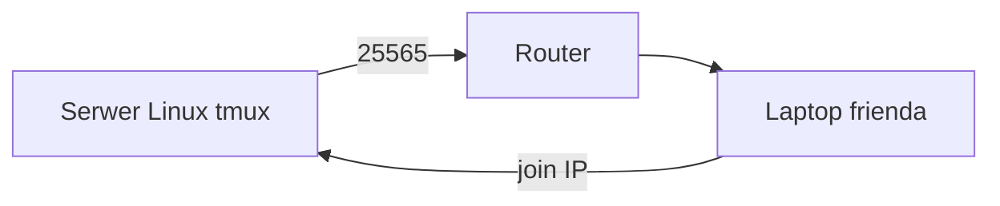

# ENGINEERING ROADMAP
## Том 1 · Лаборатория №9 — Первый большой проект: Minecraft

> **🟢 Проект уровня 1** · Миссия дня

---

## 📡 История

**10 лабораторий** позади: Linux, файлы, bash, сеть, интернет. Пора **собрать** всё в **один** проект — **сервер Minecraft**, куда **зайдёт друг**.

---

## 🚀 Миссия

**Запустить** Minecraft Java-сервер на **своём Linux**, проверить **вход с другого устройства** в **той же Wi‑Fi**.

---

## 🎯 Цель

- скачать / подготовить **server.jar** (или Paper);
- запустить в **tmux** на порту **25565**;
- друг **подключается** по **IP сервера**.

**Результат:** работающий мир + запись в dnevnik + **скрин** (без паролей).

---

## ⏱ Время

2–4 часа (можно **3 дня** по 45 мин). **Не спеши.**

---

## 🧰 Что понадобится

- [ ] Linux-сервер (Лаб. №3–6)
- [ ] **≥ 4 GB RAM** свободно для Minecraft
- [ ] Java: `sudo apt install -y openjdk-17-jre-headless`
- [ ] IP сервера (Лаб. №7)
- [ ] **EULA** — примешь в `eula.txt` (только для **личного** сервера)

---

## 🤔 Как ты думаешь?

1. Сервер и **клиент** — **одна** программа?
2. Зачем **tmux**, если уже есть скрипт backup?
3. Почему порт **25565**?

**Настоящее объяснение:** **server.jar** = **мир 24/7**. Клиенты **подключаются** по **IP:порт**. **tmux** держит мир **живым**.

---

## 💡 Аналогия

**Minecraft-сервер** = **дом**, где **все** строят. **Клиент** = **гость с ключом** (IP).

### 😲 ВАУ!

Первый **Hypixel** начинался с **одного** jar на **одном** ПК — как **твой**.

### 😄 Момент улыбки

«Не заходит» = **90%** сеть, **10%** магия. У тебя уже есть **ping** и **IP**.

---

## 📷 Иллюстрация

📷 **[Для художника]** Два ноутбука; один — сервер в tmux; второй — Minecraft «Multiplayer»; радость друга.

---

## 📊 Mermaid



---

## 🔬 Эксперимент

**Правило:** **все** эксперименты — это **шаги проекта**.

---

### Эксперимент 1 — «Java»

**⏱** 15 мин

```bash
java -version
mkdir -p ~/minecraft
cd ~/minecraft
```

| `java -version` | **JRE** установлена | Версия **17+** |

---

### Эксперiment 2 — «Скачай server.jar»

**⏱** 20 мин

На [minecraft.net](https://www.minecraft.net/en-us/download/server) скачай **server.jar** в `~/minecraft/` (или Paper — по желанию родителей).

**Проверка:** `ls -la ~/minecraft/*.jar`

---

### Эксперiment 3 — «Первый запуск и EULA»

**⏱** 20 мин

```bash
cd ~/minecraft
java -Xmx2G -Xms1G -jar server.jar nogui
```

Останови **Ctrl+C**. Открой `eula.txt`, измени `eula=false` → **`eula=true`**.  
**Только** для **домашнего** некomмерческого сервера.

---

### Эксперiment 4 — «tmux + сервер»

**⏱** 30 мин

```bash
tmux new -s minecraft
cd ~/minecraft
java -Xmx2G -Xms1G -jar server.jar nogui
```

**Ctrl+B**, **D** — отсоединиться. Сервер **работает**.

| tmux | Сервер **жив** после закрытия терминала |

---

### Эксперiment 5 — «Друг заходит»

**⏱** 30 мин

На **другом** ПК (та же Wi‑Fi): Minecraft → **Multiplayer** → **Add Server** → IP: `192.168.x.x` (твой сервер).

**✅ Проверь себя:** друг **в мире**?

**Если нет:** `ping`, firewall (`sudo ufw allow 25565/tcp` — **осторожно**, только если понимаешь).

---

## ⚠ Типичные ошибки

| Проблема | Исправление |
|----------|-------------|
| `Unable to access jarfile` | `cd ~/minecraft`, имя jar **точное** |
| Out of memory | `-Xmx2G` или меньше мир |
| Friend timeout | **Один Wi‑Fi**, верный **IP**, порт **25565** |
| EULA false | `eula=true` **осознанно** |

---

## 🧪 Проверь себя

- [ ] Сервер в **tmux** **online**
- [ ] **Ты** зашёл с основного ПК
- [ ] **Друг** зашёл **или** второй профиль / телефон (Bedrock — **другой** протокол, запиши «Java only»)
- [ ] **LAB №9** + **фото** экрана

---

## 📝 Запись в инженерный дневник

```
=== LAB №9 — PROJEKT MINECRAFT ===
Data: ___
Co zrobiłem:
  - server.jar: TAK/NIE
  - tmux minecraft: TAK/NIE
  - IP serwera: ___
  - Friend joined: TAK/NIE
  - backup.sh nadal dziala: TAK/NIE
Co było trudne:
Co zmieniłbym:
Następny pomysł (Tom 2):
```

---

## 🏆 Что теперь умеешь

- [ ] **Запустить** игровой **сервер**
- [ ] Держать его в **tmux**
- [ ] **Диагностировать** «не коннектится»
- [ ] **Завершить** **уровень 1 — Исследователь**

---

## ➡ Что дальше

**🎉 Том 1 завершён.**

**Том 2** (`../TOM_02_ELEKTRONIKA/`) **заморожен** до релиза — откроется после [`TOM_01_RELEASE_CHECKLIST.md`](../TOM_01_RELEASE_CHECKLIST.md).

- [ ] Minecraft **работает** — **обязательно**
- [ ] backup + сервер **не конфликтуют** — **обязательно**

### 🔮 Вопрос без ответа

Сервер **цифровой**. А **свет** на столе — **физический**. Как **один GPIO-пин** включает **LED**?

**Ответ — в Томе 2** (после релиза Тома 1): Raspberry Pi и **LED**.

---

*Выключи монитор. Сервер **играет** без тебя. **Ты — инженер уровня 1.***
